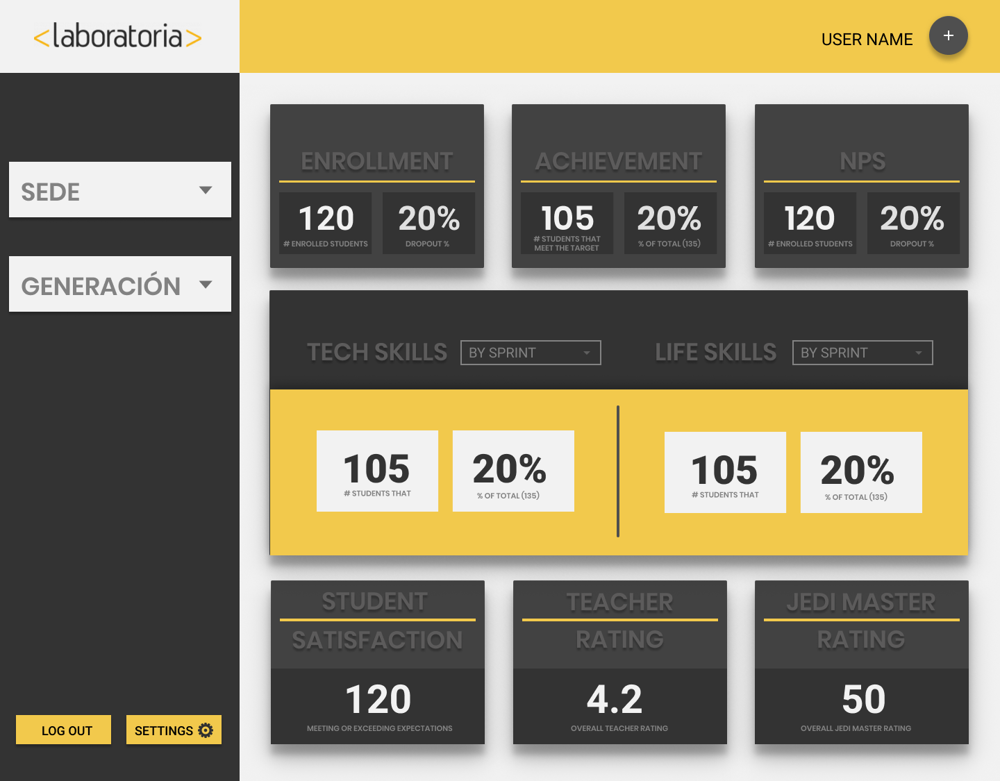

# Data Dashboard Laboratoria

 Las TMs han solicitado que construyamos una herramienta web donde puedan ver estos datos fácil y rápidamente. Y nos comentaron que estos son los datos que revisan normalmente:

 ## Requerimientos

1.- El total de estudiantes presentes por sede y generación.

2.- El porcentaje de deserción de estudiantes.

3.- La cantidad de estudiantes que superan la meta de puntos en promedio de todos los sprints cursados. La meta de puntos es 70% del total de puntos en HSE y en tech.

4.- El porcentaje que representa el dato anterior en relación al total de estudiantes.

5.- El Net Promoter Score (NPS) promedio de los sprints cursados. El NPS se calcula en base a la encuesta que las estudiantes responden al respecto de la recomendación que darían de Laboratoria.

6.- La cantidad y el porcentaje que representa el total de estudiantes que superan la meta de puntos técnicos en promedio y por sprint.

7.- La cantidad y el porcentaje que representa el total de estudiantes que superan la meta de puntos de HSE en promedio y por sprint.

8.- El porcentaje de estudiantes satisfechas con la experiencia de Laboratoria.

9.- La puntuación promedio de l@s profesores.

10.- La puntuación promedio de l@s jedi masters.

## Requerimientos adicionales

1.- Mostrar los datos procesados en un gráfico
2.- Tener un botón que permita indicar que una estudiante ha salido del Bootcamp y alterar los totales afectados por este cambio.

## Planeación Cronograma
(imagenes de cronograma)

## Definición del diseño

##
